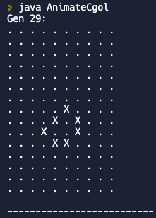

# Hunter College Advanced CS Education Certificate Portfolio
## CSCI 70900: Programming In a High-Level Language
### Name of first assignment

### Name of second assignment
stuff

## CSCI 70300 – Data Structures in a High Level Language

## SEDC 71900 – Methods I: Advanced Study of Secondary Learning Environments for Teaching Computer Science

## Some CS Jokes
* What is it called when computer programmers taunt and make fun of each other on social media? It is called cyber boolean!
* Why was the computer programmer, who was a Pokemon fanatic, very upset about his Pokemon evolving? Because he expected Char-mander to evolve into a String-mander and not Charmelion!
