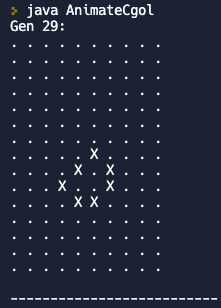

# Hunter College Advanced CS Education Certificate Portfolio
## CSCI 70900: Programming In a High-Level Language
### Conway's Game of Life Animation

### SuperArray
This project creates from scratch a class called SuperArray (similar to Java's built-in ArrayList class).
[Link to SuperArray code]([https://link-url-here.org](https://replit.com/@mthomas42/cohort-3-summer-work-marieke-thomas#programming/6/sa/SuperArray.java))

## CSCI 70300 – Data Structures in a High Level Language

## SEDC 71900 – Methods I: Advanced Study of Secondary Learning Environments for Teaching Computer Science

## Some CS Jokes
* What is it called when computer programmers taunt and make fun of each other on social media? It is called cyber boolean!
* Why was the computer programmer, who was a Pokemon fanatic, very upset about his Pokemon evolving? Because he expected Char-mander to evolve into a String-mander and not Charmelion!
